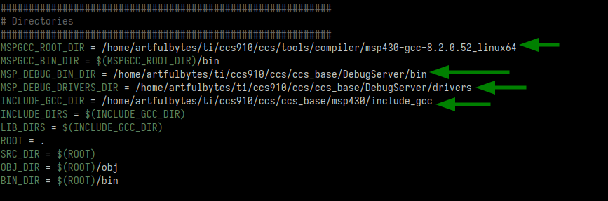

# Makefile for a microcontroller project
This repository contains a Makefile and an example project for the MSP430G2553. It serves as an example of how you can set up a Makefile for a microcontroller project.
Please read the accompanying blog post [Build and flash your microcontroller project from the command line with a Makefile](https://wwww.artfulbytes.com/makefile-step-by-step).

# How to use it for MSP430G2553?
If you have the MSP430G2553, you first need to install [CCS](https://www.ti.com/tool/CCSTUDIO) (to get the MSP430-GCC toolchain)
on a Linux machine. See the [blog post](https://www.artfulbytes.com/makefile-step-by-step) for more information.

With the toolchain installed, you have to update these paths to match your computer:



Then run

```shell
make
```

to build,

```shell
make flash
```

to flash, and

```shell
make clean
```

to remove the build files.

# How to use it for other microcontrollers?
If you have another MSP430 microcontroller than MSP430G2553, you also have to change the MCU flag, the flash command,
and maybe the code.

If you have any other microcontroller, you need to adapt the Makefile to match your toolchain as well as the example
project. Even then, you should be able to reuse the same structure and directives in the Makefile.
